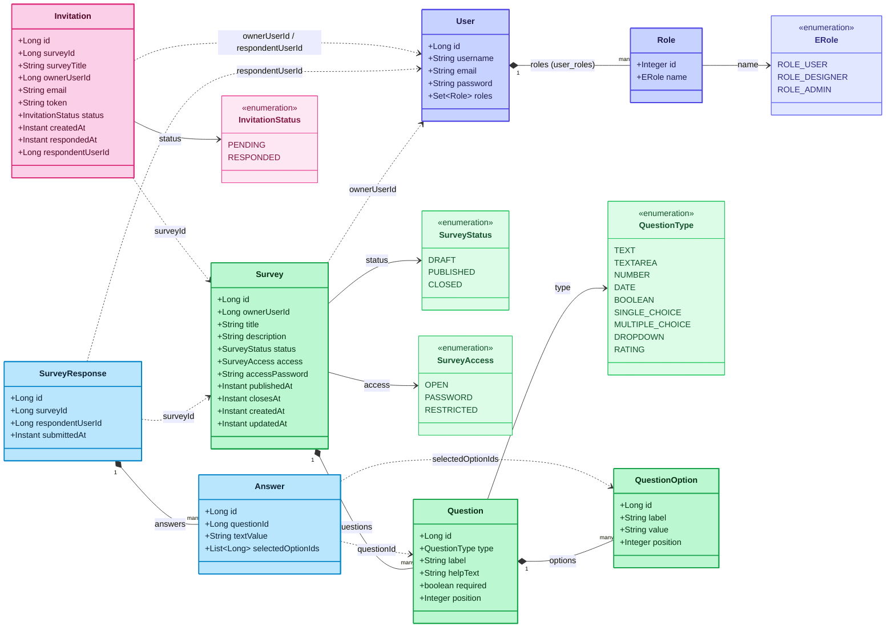
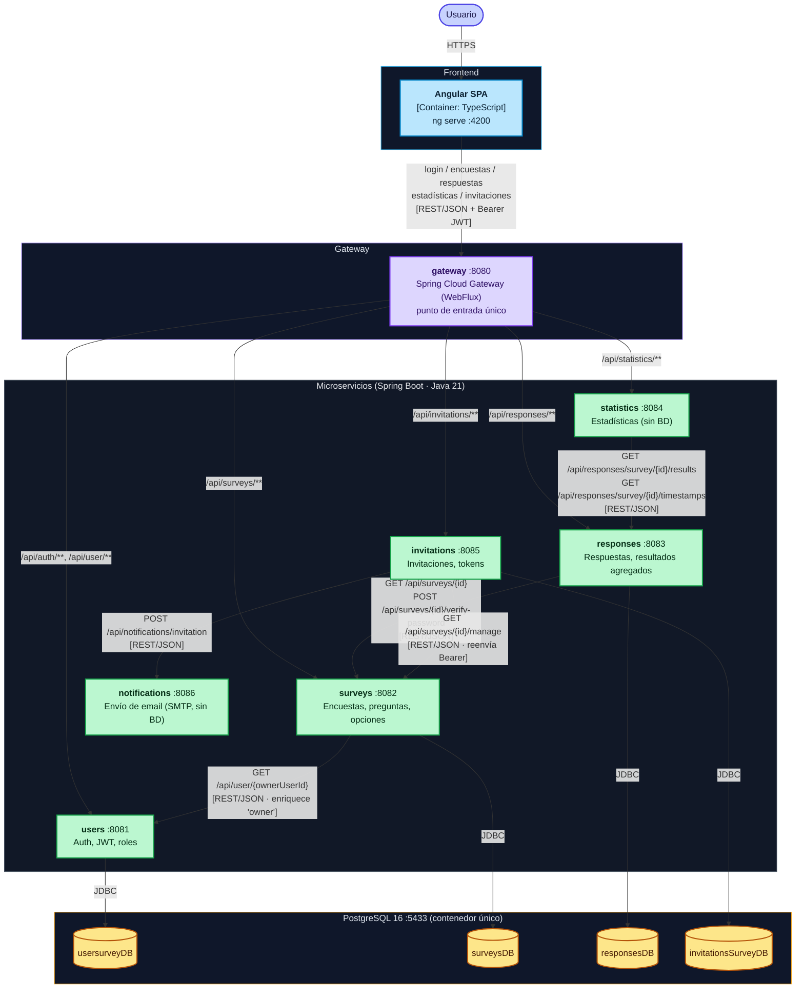
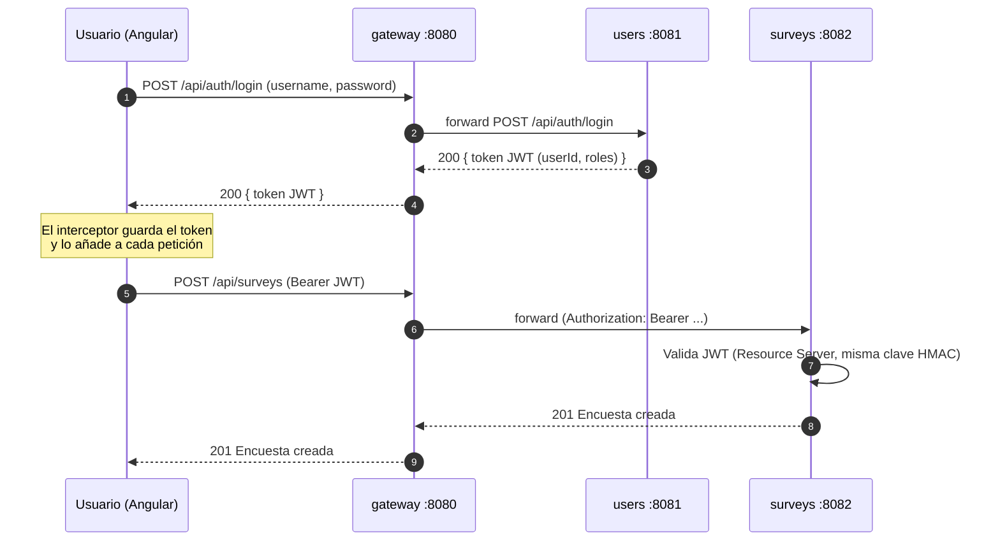
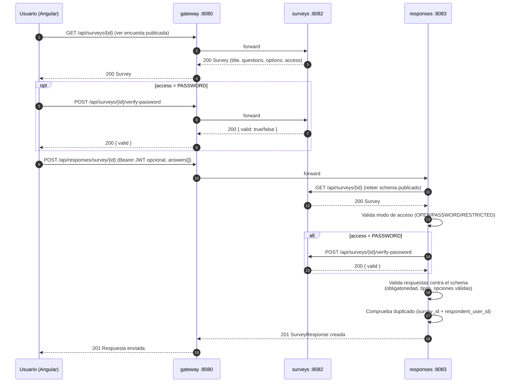
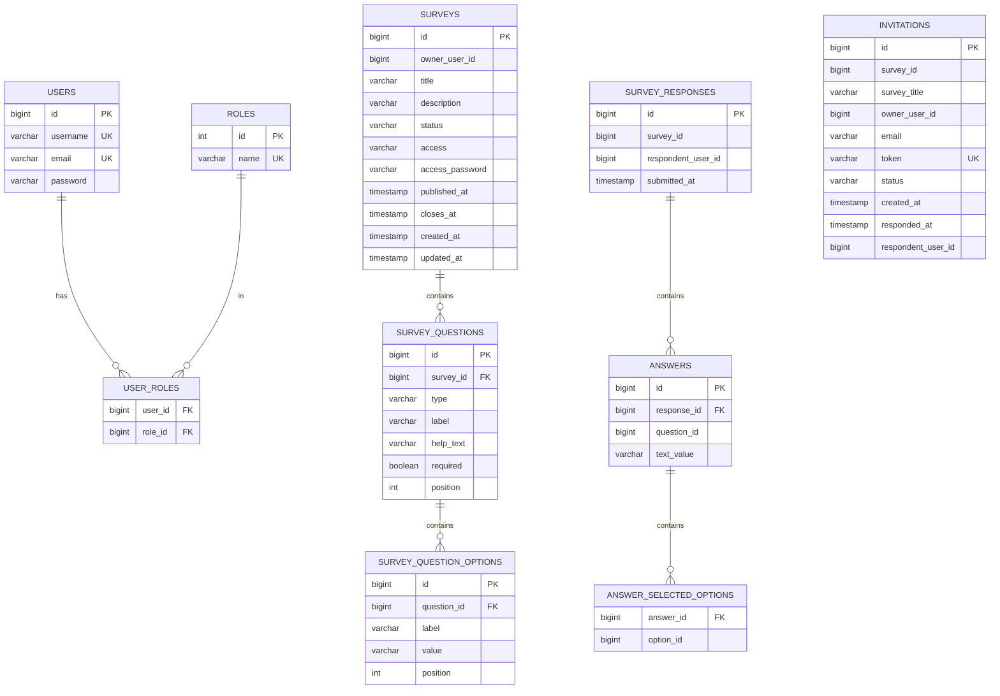

# Diagramas del sistema — EUSurvey (Spring Boot 4 + Angular, microservicios)

Este documento contiene los diagramas del proyecto en formato **Mermaid**.
Se renderizan automáticamente en GitHub, GitLab, VS Code (con extensión Mermaid),
o en https://mermaid.live.

## Cómo leer estos diagramas (niveles de abstracción)

Un sistema de microservicios se documenta con **varios diagramas
complementarios**, cada uno en su nivel. Mezclarlos en uno solo es un error
conceptual habitual. Aquí se sigue la separación estándar (inspirada en el
**modelo C4**):

| Diagrama | Nivel | Qué muestra | Qué NO muestra |
|----------|-------|-------------|----------------|
| **1. Clases del dominio** | Diseño | Entidades JPA y sus atributos; referencias entre servicios como asociaciones *punteadas* | Infraestructura |
| **2. Contenedores (C4-2)** | Arquitectura | Los microservicios, el gateway, sus bases de datos y la **comunicación HTTP/REST** entre ellos | Detalle de tablas |
| **3. Flujo de autenticación** | Comportamiento | Login y validación del JWT paso a paso | Estructura estática |
| **4. Flujo de envío de una respuesta** | Comportamiento | Cómo se responde una encuesta, con las validaciones de acceso | Estructura estática |
| **5. Entidad-relación (ER)** | Modelo físico | Tablas, columnas y **claves foráneas reales dentro de cada base de datos** | Comunicación entre servicios |

**Decisión de diseño clave (importante para entender los diagramas):** cada
microservicio con persistencia tiene su **propia base de datos** dentro de la
misma instancia de PostgreSQL (`usersurveyDB`, `surveysDB`, `responsesDB`,
`invitationsSurveyDB`). Por tanto, **no existen claves foráneas entre
servicios**. Una columna como `surveys.owner_user_id` o
`survey_responses.survey_id` es solo un identificador lógico (`Long`) que
apunta a un dato que vive en la base de datos de otro servicio; la integridad
**no** la garantiza la base de datos, sino una **llamada REST en tiempo de
ejecución** (con `RestTemplate`, reenviando el JWT del usuario) o la
validación en el momento de escribir.

Consecuencia práctica:
- En el **diagrama de contenedores** esas conexiones SÍ aparecen (son llamadas
  HTTP): `surveys → users`, `responses → surveys`, `statistics → responses`,
  `invitations → surveys`, `invitations → notifications`.
- En el **diagrama ER** esas conexiones NO aparecen como relación, porque no
  son claves foráneas reales. Que `surveys`, `responses` e `invitations`
  salgan "sueltos" entre sí es **correcto**, no un olvido.
- En el **diagrama de clases** aparecen como líneas **punteadas** (`..>`) para
  indicar "dependencia lógica por id, no relación de datos".
- Además, aquí **no hay un servicio de negocio de dos pasos** como el
  checkout de un e-commerce (descontar stock y poder revertirlo); el flujo
  equivalente más rico es el **envío de una respuesta**, porque combina una
  llamada de solo lectura a otro servicio (`responses → surveys`) con
  validaciones de negocio (modo de acceso, duplicados, esquema de preguntas).

---

## 1. Diagrama de clases del dominio (entidades JPA)

> **Nota sobre `Survey.owner`:** es un `Map<String,Object>` `@Transient` que
> **no se persiste**; se rellena en tiempo de ejecución con la respuesta de
> `GET /api/user/{id}` en `users` (mismo patrón que `Product.seller` en un
> e-commerce). Por eso no aparece como columna en el ER. `accessPassword` es
> `@JsonProperty(WRITE_ONLY)`: se puede enviar al crear/editar, pero nunca se
> devuelve al cliente.

---

## 2. Diagrama de contenedores (C4 nivel 2)

Vista de arquitectura. Un **gateway** (Spring Cloud Gateway, WebFlux) como
único punto de entrada, y cinco microservicios Spring Boot independientes
(cuatro con base de datos propia, uno —`statistics`— sin base de datos, y
`notifications` sin base de datos), más el frontend Angular. **Las flechas
etiquetadas `[REST/JSON]` son llamadas HTTP** (con `RestTemplate`, reenviando
el JWT recibido), no relaciones de base de datos.

> **Leyenda:** flecha continua `[REST/JSON]` = llamada HTTP síncrona entre
> servicios (reenvía el JWT recibido en `Authorization`, vía el interceptor de
> `RestTemplateConfig`). `JDBC` = acceso de cada servicio a su **propia** base
> de datos. No hay accesos cruzados a bases de datos ajenas. A diferencia de
> un despliegue con `Eureka`/`service discovery`, aquí el `gateway` usa un
> **enrutado estático** (`GatewayConfig`) con las URLs de cada servicio
> inyectadas por variables de entorno.

---

## 3. Flujo de autenticación (JWT como Resource Server)

`users` emite el token al hacer login (con los claims `userId` y `roles`); el
resto de servicios lo validan como **OAuth2 Resource Server** con la misma
clave secreta HMAC (`NimbusJwtDecoder`, HmacSHA256). El token viaja en la
cabecera `Authorization: Bearer ...`, pasa a través del gateway sin
modificarse, y se reenvía entre servicios cuando uno necesita llamar a otro.

---

## 4. Flujo de envío de una respuesta a una encuesta

Equivalente al "checkout": es el flujo de negocio más rico del sistema.
`responses` no confía en lo que le manda el cliente sobre la encuesta —vuelve
a pedir el esquema publicado a `surveys` y, si hace falta, valida la
contraseña— antes de aceptar la respuesta.

> **Nota:** si la encuesta es `RESTRICTED`, el paso de acceso público
> `GET /api/surveys/{id}` sigue devolviendo la encuesta (es de solo lectura),
> pero el envío (`POST /api/responses/survey/{id}`) exige un JWT válido; sin
> token, `responses` responde `401`. Con `PASSWORD`, además se exige estar
> autenticado y enviar `accessPassword` en el cuerpo.

---

## 5. Modelo entidad-relación (por base de datos)

Cada recuadro pertenece a una **base de datos independiente** dentro de la
misma instancia de PostgreSQL. Solo se dibujan las **claves foráneas reales**
(las que existen dentro de una misma base). Por diseño, `SURVEYS`,
`SURVEY_RESPONSES` e `INVITATIONS` **no** están conectados entre sí en este
diagrama: sus referencias (`survey_id`, `owner_user_id`,
`respondent_user_id`...) son identificadores lógicos hacia otras bases,
resueltos por HTTP, **no** claves foráneas. Que aparezcan como tablas sueltas
es lo correcto en un ER; la comunicación entre ellas se ve en el **diagrama de
contenedores (nº 2)**.

> **Restricciones únicas relevantes (no siempre visibles en un ER simple):**
> `survey_responses` tiene una clave única compuesta
> `(survey_id, respondent_user_id)` — una persona registrada solo puede
> responder una vez a cada encuesta (las respuestas anónimas no se
> deduplican). `invitations` tiene `token` único y una clave única compuesta
> `(survey_id, email)` — no se invita dos veces al mismo correo a la misma
> encuesta.
